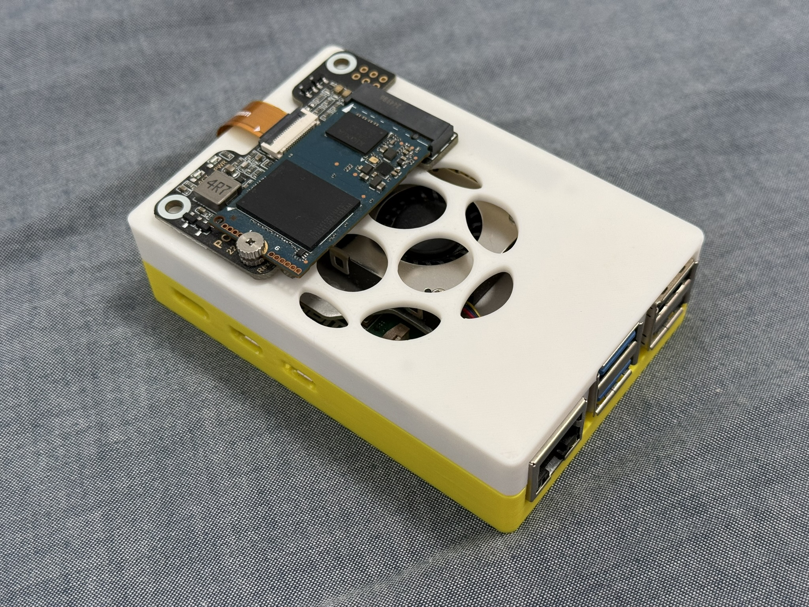
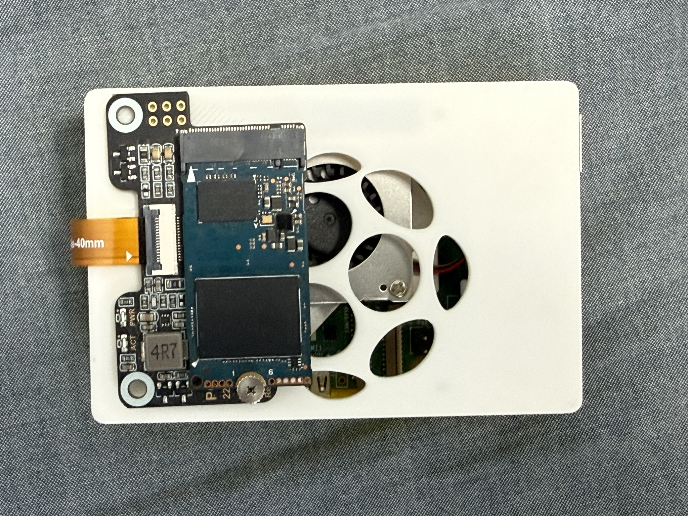

[English](README.md) | [简体中文](README_CN.md)

# Raspberry Pi 3 / Raspberry Pi 5 3D-Printed Case

This project contains **3D-printable protective cases for Raspberry Pi 3 and Raspberry Pi 5**.

The cases are designed to protect the Raspberry Pi board during everyday use, helping reduce the risk of damage caused by accidental impacts, dust, or unintended contact.

The models are designed for 3D printing and include openings for the Raspberry Pi's various ports and connectors, while aiming to maintain normal access to the board's interfaces.

## Preview

### Overview

### SD Card

The button opening has a slight positional offset. It does not affect basic functionality, but the fit is not ideal.

If you have experience with 3D modeling and would like to help improve the design, contributions and optimized versions are welcome. Thank you!

### Top Cover

Some openings on the top cover do not perfectly match the corresponding interfaces.

The case is usable, but some of the openings have slight positional or dimensional deviations, which affects the overall appearance.

If you have the ability to modify 3D models, feel free to help optimize the position and dimensions of these openings for a better fit.

### HDMI Interface

## File Description

### Raspberry Pi 3

* `Raspberry_Pi_3/5_Case_Top.stl`

  * Raspberry Pi 3 top cover

* `Raspberry_Pi_3_Case.stl`

  * Raspberry Pi 3 bottom case

### Raspberry Pi 5

* `Raspberry_Pi_3/5_Case_Top.stl`

  * Raspberry Pi 5 top cover

* `Raspberry_Pi_5_Case-Ai.stl`

  * Modified version of the Raspberry Pi 5 case

* `Raspberry_Pi_5_Case.3dm`

  * Rhino 3DM file for the Raspberry Pi 5 case

* `Raspberry_Pi_5_Case.stl`

  * Raspberry Pi 5 bottom case

## Model Source and Modification

### Raspberry Pi 3

The Raspberry Pi 3 case model was obtained from the Internet and has been organized and preserved in this project.

Unfortunately, due to the age of the files, the original author and the original publication source can no longer be confirmed.

If you know the original author or source of this model, please feel free to contact me. I will update the project with the appropriate attribution and source information.

### Raspberry Pi 5

The Raspberry Pi 5 case models were **modified and adapted based on the above Raspberry Pi 3 case model**.

The modifications mainly address the dimensions of the Raspberry Pi 5 board, the positions of its interfaces, and SD card access. Additional structural changes were also made based on actual usage.

Therefore, the Raspberry Pi 5 models are **modified/derivative versions based on the original model**, rather than designs created entirely from scratch.

I would like to thank the original model creator for providing the foundation for these modifications, as well as everyone in the Raspberry Pi and 3D-printing communities who shares models and design experience.

If you are the original author, or know the original source of the model, please contact me. I will do my best to add the correct attribution, original link, and license information.

## Acknowledgements

Thanks to the original creators of these 3D models, as well as the Raspberry Pi, 3D-printing, and open-source hardware communities.

Although the original source of some of these models can no longer be confirmed, their preservation, organization, and continued use would not have been possible without the contributions of the original creators and community members.

**Special thanks to everyone who contributes models, designs, and knowledge to the Raspberry Pi and 3D-printing communities.**

If you are the original creator of any model included in this project, please feel free to contact me. I will do my best to add the correct attribution and original source information.

## Disclaimer

These models are provided for **personal learning, 3D printing, and non-commercial use**.

Due to incomplete information about the original models and their historical versions, compatibility with different Raspberry Pi board revisions, accessories, or 3D printers cannot be guaranteed.

Please verify the model dimensions, interface positions, and compatibility with your own Raspberry Pi board before printing.

Raspberry Pi and related names and logos are trademarks of their respective owners. This project is an independent community project and is not affiliated with or endorsed by Raspberry Pi Ltd.

## License

Because the original author and license information for some of the models cannot currently be verified, **no new license is claimed for the original models in this project**.

If the original author and license information can be identified in the future, this section will be updated according to the original author's licensing terms.

If you are the original author and would like to request attribution, modification, or removal of any related files, please contact the project maintainer.
